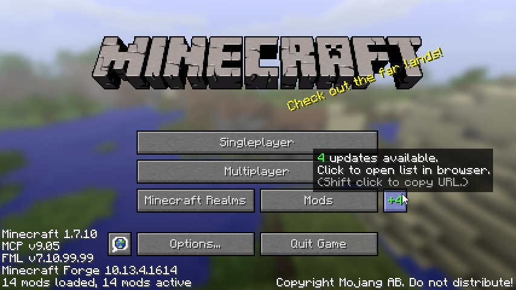
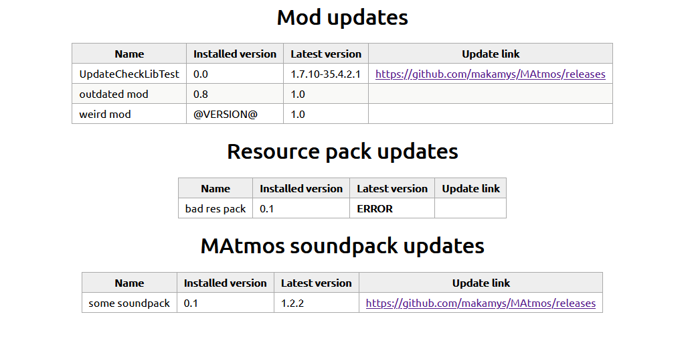

**This project has been merged into [MCLib](https://github.com/makamys/MCLib) and is no longer maintained. The information below is provided for historical purposes only.**

---

# UpdateCheckLib

This is a library Minecraft mods can use to check for updates. When there are mods with updates available, a button will appear in the main menu.

Clicking this button will open a simple HTML file containing the results of the update check.


*Note: the results in the picture are dummy data provided by test cases, not real world results.*

You can also add update check tasks for non-mod *components* such as resource packs, or custom categories you define.

# Usage

Releases are published on JitPack. To add this library as a dependency for your Gradle project, add this to your buildscript:

```gradle
repositories {
	maven { url 'https://jitpack.io' }
}

dependencies {
	compile 'com.github.makamys:UpdateCheckLib:1.0'
}
```

You also need to get the library to the users' mods folder in some way when releasing. You can tell them to download it manually from the project's [releases tab](https://github.com/makamys/UpdateCheckLib/releases), or use [CodeChickenCore](https://github.com/Chicken-Bones/CodeChickenLib/tree/1.7)'s DepLoader or [MCLib](https://github.com/makamys/MCLib)'s SloppyDepLoader to download it automatically.

> I use the latter option in my projects. In addition, MCLib has a helper class for easily adding update tasks to mods. See [this commit](https://github.com/makamys/Satchels/commit/965478ca91f6d7eb9c87981ffde23e40397ba172) for example.

If you're using UpdateCheckLib directly, use the [`UpdateCheckAPI`](https://javadoc.jitpack.io/com/github/makamys/UpdateCheckLib/90a4387/javadoc/makamys/updatechecklib/UpdateCheckAPI.html) class's methods to register update check tasks before the post-init phase.

# License

This project is licensed under [the Unlicense](LICENSE).

# Contributing

The library has a test package containing a test mod which registers some test update check tasks. This package is excluded from builds normally. To enable it, add `-Penable_test=true` to your Gradle command.
